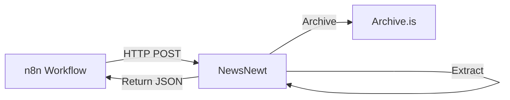

# NewsNewt - Deployment Guide

**Last Updated:** 2025-11-25

## Overview

This guide covers deploying NewsNewt in various environments, from local development to production Docker deployments.

## Table of Contents

1. [Prerequisites](#prerequisites)
2. [Local Development](#local-development)
3. [Docker Deployment](#docker-deployment)
4. [Production Deployment](#production-deployment)
5. [Monitoring & Logging](#monitoring--logging)
6. [Troubleshooting](#troubleshooting)
7. [Upgrade Guide](#upgrade-guide)

---

## Prerequisites

### System Requirements

- **Docker:** Version 20.10+ (for containerized deployment)
- **Docker Compose:** Version 2.0+ (recommended)
- **Python:** 3.12+ (for local development)
- **uv:** Latest version (for dependency management)

### Port Requirements

- **8000:** HTTP API endpoint (configurable)

### Network Requirements

- Outbound HTTPS access to:
  - `archive.is` / `archive.today` (for archiving)
  - `pypi.org` (for dependency installation during build)

---

## Local Development

### 1. Clone Repository

```bash
git clone <repository-url>
cd NewsNewt
```

### 2. Install Dependencies

```bash
# Install uv if not already installed
curl -LsSf https://astral.sh/uv/install.sh | sh

# Install project dependencies
uv sync

# Install development dependencies
uv sync --extra dev
```

### 3. Configure Environment (Optional)

```bash
# Copy sample configuration
cp .env.sample .env

# Edit configuration as needed
# nano .env
```

### 4. Run Service

```bash
# Run the service
uv run python -m newsnewt.main

# Service will be available at http://localhost:8000
```

### 5. Verify Service

```bash
# Health check
curl http://localhost:8000/health

# Expected response: {"status":"ok"}

# Service info
curl http://localhost:8000/
```

---

## Docker Deployment

### Quick Start

```bash
# Start service with Docker Compose
docker compose up -d

# Check status
docker compose ps

# View logs
docker compose logs -f

# Stop service
docker compose down
```

### Custom Configuration

#### Option 1: Using .env File

```bash
# Copy sample configuration
cp .env.sample .env

# Edit configuration
nano .env

# Start with custom configuration
docker compose up -d
```

#### Option 2: Environment Variables

```bash
# Start with inline environment variables
NEWSNEWT_LOG_LEVEL=DEBUG \
NEWSNEWT_TIMEOUT_SECONDS=600 \
docker compose up -d
```

#### Option 3: Custom compose.yml

Create a `docker-compose.override.yml`:

```yaml
version: "3.8"

services:
  newsnewt:
    environment:
      - NEWSNEWT_LOG_LEVEL=DEBUG
      - NEWSNEWT_TIMEOUT_SECONDS=600
    ports:
      - "9000:8000" # Custom port mapping
```

### Manual Docker Build

```bash
# Build image
docker build -t newsnewt:latest -f dockerfile .

# Run container
docker run -d \
  --name newsnewt \
  -p 8000:8000 \
  -e NEWSNEWT_LOG_LEVEL=INFO \
  -e NEWSNEWT_TIMEOUT_SECONDS=300 \
  -v $(pwd)/logs:/app/logs \
  --restart unless-stopped \
  newsnewt:latest

# Check logs
docker logs -f newsnewt

# Stop container
docker stop newsnewt && docker rm newsnewt
```

### Health Checks

The Docker image includes automatic health checks:

```bash
# Check health status
docker inspect --format='{{.State.Health.Status}}' newsnewt

# View health check logs
docker inspect --format='{{json .State.Health}}' newsnewt
```

Health check configuration:

- **Interval:** 30 seconds
- **Timeout:** 10 seconds
- **Start period:** 5 seconds
- **Retries:** 3

---

## Production Deployment

### Architecture Considerations

#### Private Network

NewsNewt is designed for private network deployment:



#### Recommended Setup

- Deploy behind reverse proxy (nginx, traefik)
- Use internal Docker network (no public exposure)
- Mount logs directory for persistence
- Set resource limits
- Configure restart policy

### Production docker-compose.yml

```yaml
version: "3.8"

services:
  newsnewt:
    build:
      context: .
      dockerfile: dockerfile
    container_name: newsnewt
    restart: unless-stopped
    ports:
      - "127.0.0.1:8000:8000" # Only bind to localhost
    environment:
      - NEWSNEWT_ARCHIVE_SERVICE=${NEWSNEWT_ARCHIVE_SERVICE:-archive_is}
      - NEWSNEWT_TIMEOUT_SECONDS=${NEWSNEWT_TIMEOUT_SECONDS:-300}
      - NEWSNEWT_LOG_LEVEL=${NEWSNEWT_LOG_LEVEL:-INFO}
      - TZ=${TZ:-UTC}
    volumes:
      - ./logs:/app/logs
    networks:
      - internal
    deploy:
      resources:
        limits:
          cpus: "1.0"
          memory: 512M
        reservations:
          cpus: "0.5"
          memory: 256M
    healthcheck:
      test:
        [
          "CMD",
          "python",
          "-c",
          "import urllib.request; urllib.request.urlopen('http://localhost:8000/health')",
        ]
      interval: 30s
      timeout: 10s
      retries: 3
      start_period: 5s

networks:
  internal:
    driver: bridge
```

### Environment Variables

Production-ready environment configuration:

```env
# Production Configuration

# Archive Service
NEWSNEWT_ARCHIVE_SERVICE=archive_is

# Timeout (increase for production)
NEWSNEWT_TIMEOUT_SECONDS=600

# Logging (use INFO or WARNING in production)
NEWSNEWT_LOG_LEVEL=INFO

# Timezone
TZ=UTC
```

### Resource Requirements

#### Minimum Resources

- **CPU:** 0.5 cores
- **RAM:** 256 MB
- **Disk:** 1 GB (including logs)

#### Recommended Resources

- **CPU:** 1.0 cores
- **RAM:** 512 MB
- **Disk:** 5 GB (for log rotation)

### Security Best Practices

1. **Network Isolation**

   - Deploy in private Docker network
   - Do not expose publicly
   - Use reverse proxy with authentication if needed

2. **Environment Variables**

   - Never commit `.env` files to version control
   - Use Docker secrets or environment variables
   - Rotate credentials regularly

3. **Logging**

   - Mount logs volume for persistence
   - Implement log rotation (built-in)
   - Monitor logs for errors
   - Redact sensitive information

4. **Updates**
   - Regularly rebuild Docker images
   - Update dependencies
   - Review security advisories

### Performance Tuning

#### Rate Limiting

NewsNewt includes built-in rate limiting for Archive.is (5-second minimum interval). Adjust if needed by modifying `src/newsnewt/rate_limit.py`:

```python
# Default: 5 seconds between requests
archive_rate_limiter = RateLimiter(min_interval_seconds=5.0)
```

#### Timeout Configuration

Adjust timeout based on your network and Archive.is response times:

```env
# Default: 300 seconds
NEWSNEWT_TIMEOUT_SECONDS=600

# For faster networks
NEWSNEWT_TIMEOUT_SECONDS=120
```

#### Log Rotation

Log rotation is automatic:

- **Max file size:** 10 MB
- **Backup count:** 5 files
- **Total disk usage:** ~50 MB

Adjust in `src/newsnewt/logging_config.py` if needed.

---

## Monitoring & Logging

### Health Checks

#### Manual Health Check

```bash
# HTTP health check
curl http://localhost:8000/health

# Expected response
{"status":"ok"}
```

#### Docker Health Check

```bash
# Check container health
docker inspect --format='{{.State.Health.Status}}' newsnewt

# Possible statuses:
# - starting: Container is starting up
# - healthy: Container is healthy
# - unhealthy: Health check is failing
```

### Log Monitoring

#### View Live Logs

```bash
# Docker Compose
docker compose logs -f newsnewt

# Docker
docker logs -f newsnewt
```

#### Log Locations

- **Container:** `/app/logs/newsnewt.log`
- **Host:** `./logs/newsnewt.log` (if volume mounted)

#### Log Format

```
2025-11-25 15:30:00 UTC - module.name - LEVEL - message
```

#### Log Levels

- **DEBUG:** Detailed debugging information
- **INFO:** General informational messages (default)
- **WARNING:** Warning messages
- **ERROR:** Error messages
- **CRITICAL:** Critical errors

### Monitoring Endpoints

#### Service Information

```bash
GET /
```

Returns service status and available endpoints.

#### Health Endpoint

```bash
GET /health
```

Returns `200 OK` with `{"status":"ok"}` if service is healthy.

---

## Troubleshooting

### Common Issues

#### Container Won't Start

**Symptoms:**

- Container exits immediately
- Health check fails

**Solutions:**

```bash
# Check logs
docker logs newsnewt

# Check environment variables
docker inspect newsnewt | grep -A 20 "Env"

# Rebuild without cache
docker build --no-cache -t newsnewt:latest -f dockerfile .
```

#### Port Already in Use

**Symptoms:**

- Error: `bind: address already in use`

**Solutions:**

```bash
# Check what's using port 8000
lsof -i :8000

# Use different port in compose.yml
ports:
  - "9000:8000"  # Host port 9000
```

#### Archive.is Rate Limiting

**Symptoms:**

- HTTP 429 errors in logs
- Archive requests failing

**Solutions:**

- Built-in rate limiting should prevent this (5-second intervals)
- If persistent, increase interval in `rate_limit.py`
- Consider implementing exponential backoff

#### Extraction Failures

**Symptoms:**

- `EXTRACTION_FAILURE` errors
- Empty body text

**Solutions:**

```bash
# Check trafilatura configuration
# Verify article URL is accessible
# Review extraction logs for details

# Test extraction locally
uv run python -c "
from newsnewt.extractor import extract_article_content
content = extract_article_content(html)
print(content)
"
```

#### Timeout Errors

**Symptoms:**

- `ARCHIVE_TIMEOUT` errors
- Requests hanging

**Solutions:**

```env
# Increase timeout in .env
NEWSNEWT_TIMEOUT_SECONDS=600

# Check network connectivity
# Verify Archive.is is accessible
curl -I https://archive.is
```

### Debug Mode

Enable debug logging for troubleshooting:

```env
NEWSNEWT_LOG_LEVEL=DEBUG
```

Restart the service and review logs:

```bash
docker compose down
docker compose up -d
docker compose logs -f newsnewt
```

---

## Upgrade Guide

### Upgrading NewsNewt

#### Step 1: Backup

```bash
# Backup logs
cp -r logs logs.backup

# Backup configuration
cp .env .env.backup
```

#### Step 2: Pull Updates

```bash
# Pull latest code
git pull origin main

# Or download new release
# wget https://github.com/.../releases/...
```

#### Step 3: Rebuild

```bash
# Stop current service
docker compose down

# Rebuild image
docker compose build --no-cache

# Start with new image
docker compose up -d
```

#### Step 4: Verify

```bash
# Check health
curl http://localhost:8000/health

# Check version
curl http://localhost:8000/ | grep version

# Review logs
docker compose logs -f
```

### Rollback

If upgrade fails:

```bash
# Stop new version
docker compose down

# Restore configuration
cp .env.backup .env

# Checkout previous version
git checkout <previous-tag>

# Rebuild and start
docker compose up -d --build
```

---

## Deployment Checklist

### Pre-Deployment

- [ ] Review system requirements
- [ ] Configure environment variables
- [ ] Review security settings
- [ ] Plan resource allocation
- [ ] Configure log retention
- [ ] Set up monitoring

### Deployment

- [ ] Build Docker image
- [ ] Start container
- [ ] Verify health check
- [ ] Test API endpoints
- [ ] Review logs
- [ ] Configure restart policy

### Post-Deployment

- [ ] Monitor resource usage
- [ ] Review logs for errors
- [ ] Test with real URLs
- [ ] Document deployment
- [ ] Set up alerting (if needed)
- [ ] Schedule maintenance

---

## Support

For issues or questions:

1. Review this deployment guide
2. Check [troubleshooting section](#troubleshooting)
3. Review logs for detailed error messages
4. Check [technical documentation](technical.md)
5. Review [testing documentation](TESTING.md)

---

## Appendix

### A. Example nginx Reverse Proxy

```nginx
server {
    listen 80;
    server_name newsnewt.internal;

    location / {
        proxy_pass http://127.0.0.1:8000;
        proxy_set_header Host $host;
        proxy_set_header X-Real-IP $remote_addr;
        proxy_set_header X-Forwarded-For $proxy_add_x_forwarded_for;
        proxy_set_header X-Forwarded-Proto $scheme;

        # Timeouts
        proxy_connect_timeout 60s;
        proxy_send_timeout 300s;
        proxy_read_timeout 300s;
    }
}
```

### B. Example Systemd Service (Non-Docker)

```ini
[Unit]
Description=NewsNewt Service
After=network.target

[Service]
Type=simple
User=newsnewt
WorkingDirectory=/opt/newsnewt
Environment="PATH=/opt/newsnewt/.venv/bin"
ExecStart=/opt/newsnewt/.venv/bin/python -m newsnewt.main
Restart=always
RestartSec=10

[Install]
WantedBy=multi-user.target
```

### C. Example n8n Integration

```json
{
  "nodes": [
    {
      "parameters": {
        "url": "http://newsnewt:8000/article",
        "method": "POST",
        "bodyParameters": {
          "parameters": [
            {
              "name": "url",
              "value": "={{$json[\"url\"]}}"
            },
            {
              "name": "force_archive",
              "value": false
            }
          ]
        }
      },
      "name": "Archive Article",
      "type": "n8n-nodes-base.httpRequest"
    }
  ]
}
```
