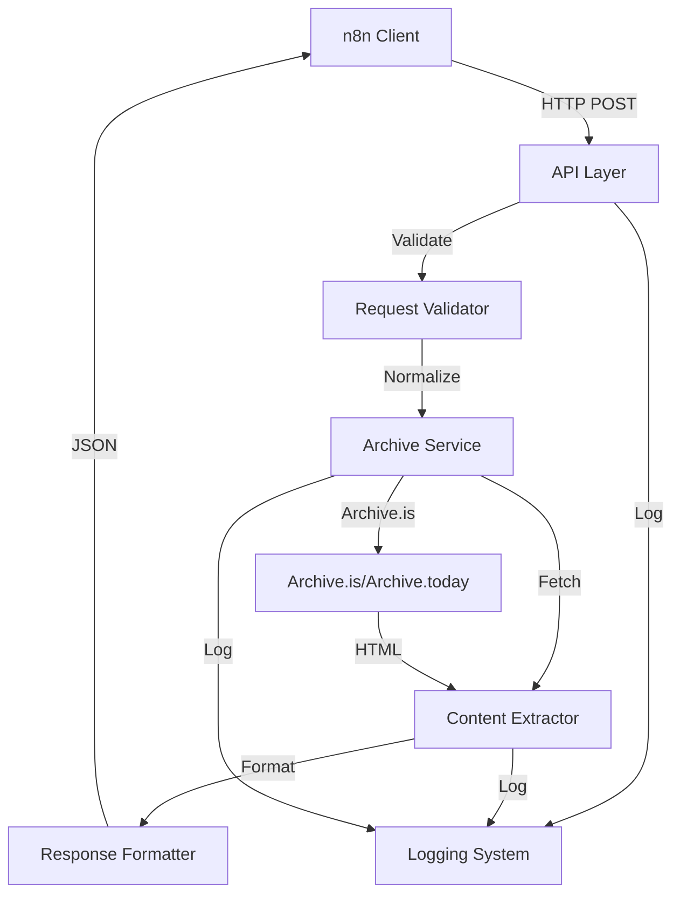

# NewsNewt - Architecture Documentation

> **System architecture, component interactions, and design decisions**

## System Architecture Overview

NewsNewt follows a simple, layered architecture optimized for reliability and maintainability. The system is designed as a stateless microservice with clear separation of concerns.

---

## Component Architecture



---

## Layer Responsibilities

### 1. API Layer (`api.py`)

**Responsibilities:**

- HTTP request/response handling
- Route definitions (POST /article, GET /health)
- Error response formatting
- Request logging

**Interfaces:**

- Receives JSON requests
- Returns JSON responses
- Handles HTTP status codes

### 2. Request Validation Layer (`utils.py`)

**Responsibilities:**

- URL validation and normalization
- Request schema validation
- Archive service selection logic
- Input sanitization

**Interfaces:**

- Validates incoming requests
- Normalizes URLs
- Returns validation errors

### 3. Archive Service Layer (`archive.py`)

**Responsibilities:**

- Archive service abstraction
- Archive URL resolution (new or existing)
- Archive HTML fetching
- Timeout handling

**Interfaces:**

- Takes URL and archive flags
- Returns archive URL and HTML content
- Handles archive service errors

### 4. Content Extraction Layer (`extractor.py`)

**Responsibilities:**

- HTML parsing and cleaning using trafilatura
- Article body text extraction (required, minimum 50 characters)
- Error handling for extraction failures

**Interfaces:**

- Takes HTML content and URL
- Returns plain text body content
- Handles extraction failures with ExtractionError

### 5. Data Models Layer (`models.py`)

**Responsibilities:**

- Request/response schemas
- Data validation
- Type definitions

**Interfaces:**

- Defines data structures
- Validates data formats

---

## Data Flow

### Successful Request Flow

```
1. n8n → POST /article
   {
     "url": "https://example.com/news/article",
     "force_archive": false,
     "archive_service": "auto"
   }

2. API Layer validates request format

3. Request Validator validates URL and resolves archive service

4. Archive Service:
   - Checks for existing archive (if not force_archive)
   - Creates new archive if needed
   - Fetches archived HTML

5. Content Extractor:
   - Parses HTML using trafilatura
   - Extracts article body text (minimum 50 characters)
   - Validates extracted content

6. API Layer structures response:
   - Creates ArticleResponse with url, archive_url, body_text
   - Optional metadata fields set to None (MVP)

7. API Layer returns 200 OK with JSON

8. n8n receives structured article data
```

### Error Flow

```
1. n8n → POST /article (invalid URL)

2. Request Validator detects invalid URL

3. Error Handler creates error response:
   {
     "detail": {
       "error": {
         "code": "INVALID_URL",
         "message": "...",
         "details": {...}
       }
     }
   }

4. API Layer returns 400/422 Bad Request

5. n8n receives error response
```

---

## Component Interactions

### Archive Service Integration

The archive service layer abstracts the Archive.is/Archive.today integration:

```python
# Simplified interface
def archive_url(url: str, force: bool = False) -> tuple[str, str]:
    """
    Archive URL and return (archive_url, html_content).

    Args:
        url: Original article URL
        force: Whether to force new archive creation

    Returns:
        Tuple of (archive_url, html_content)

    Raises:
        ArchiveTimeoutError: If archiving exceeds timeout
        ArchiveFailureError: If archiving fails
    """
```

### Content Extraction

The extractor uses trafilatura to extract content:

```python
# Actual interface
async def extract_article_content(html: str, url: str) -> str:
    """
    Extract article body text from HTML.

    Args:
        html: HTML content from archive
        url: Original URL (for context)

    Returns:
        Plain text body content (minimum 50 characters)

    Raises:
        ExtractionError: If extraction fails or content is insufficient
    """
```

---

## Error Handling Architecture

### Error Propagation

```
Request → Validation Error → API Layer → Error Response (400)
                                ↓
Request → Archive Error → API Layer → Error Response (500)
                                ↓
Request → Extraction Error → API Layer → Error Response (500)
                                ↓
Request → Unexpected Error → API Layer → Error Response (500, INTERNAL_ERROR)
```

### Error Response Standardization

All errors follow a consistent structure (wrapped in FastAPI's `detail` field):

```json
{
  "detail": {
    "error": {
      "code": "ERROR_CODE",
      "message": "Human-readable message",
      "details": {
        "context": "specific to error type"
      }
    }
  }
}
```

---

## Configuration Architecture

### Environment-Based Configuration

- All configuration via environment variables
- No hardcoded values
- Default values provided
- `.env.sample` documents all options

### Configuration Flow

```
Environment Variables
    ↓
Configuration Loader
    ↓
Application Components
    ↓
Runtime Behavior
```

---

## Logging Architecture

### Logging Flow

```
Request → API Layer → Log Request Start
    ↓
Processing → Components → Log Progress
    ↓
Success/Error → API Layer → Log Outcome + Duration
    ↓
Log Handler → Rotating File Handler → logs/newsnewt.log
```

### Log Structure

All logs include:

- Timestamp (ISO 8601 UTC)
- Log level
- Component/module name
- Message with context
- Request duration (for completed requests)

---

## Deployment Architecture

### Container Architecture

```
┌─────────────────────────────────┐
│   Docker Container              │
│                                 │
│   ┌──────────────────────────┐  │
│   │   NewsNewt Service       │  │
│   │   (Python 3.12)          │  │
│   │   Port: 8000             │  │
│   └──────────────────────────┘  │
│                                 │
│   ┌──────────────────────────┐  │
│   │   Logs Volume            │  │
│   │   /app/logs/             │  │
│   └──────────────────────────┘  │
│                                 │
│   Environment Variables         │
└─────────────────────────────────┘
         │
         │ Private Docker Network
         │
    ┌────┴────┐
    │   n8n   │
    └─────────┘
```

### Network Architecture

- **Internal Network:** Private Docker network
- **Service Discovery:** Via service name (newsnewt)
- **Port Exposure:** Internal only (no public ports)
- **Communication:** HTTP over private network

---

## Design Principles

1. **Separation of Concerns:** Each layer has a single, clear responsibility
2. **Stateless Design:** No session state, each request is independent
3. **Fail Fast:** Early validation and error detection
4. **Explicit Error Handling:** All error paths are explicit and logged
5. **Configuration Over Code:** All behavior configurable via environment
6. **Observable:** Comprehensive logging at all levels

---

## Scalability Considerations

### Current Design (Single Instance)

- Stateless service allows horizontal scaling
- No shared state between instances
- Can scale via container orchestration

### Rate Limiting

- Built-in rate limiting for Archive.is (5-second minimum interval)
- Prevents 429 errors from archive service
- Async-safe with lock mechanism

---

## Security Architecture

### Network Security

- Private Docker network isolation
- No public internet exposure
- Network-level security assumed

### Input Security

- URL validation and sanitization
- Request size limits
- Timeout protection

### Output Security

- Sanitized error messages
- No sensitive data in logs
- Structured error responses

---

## Monitoring & Observability

### Health Checks

- GET /health endpoint for container orchestration
- Returns service status
- No external dependencies

### Logging

- Structured logging with context
- Log rotation for disk management
- Configurable log levels

### Logging Features

- Request/response logging with context
- Duration tracking for completed requests
- Structured log format with UTC timestamps
- Configurable log levels (DEBUG, INFO, WARNING, ERROR, CRITICAL)
